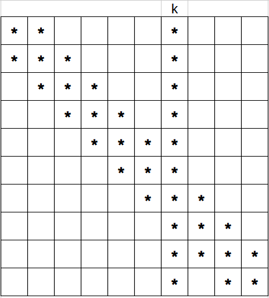
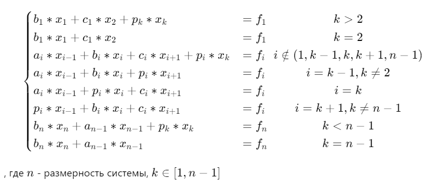
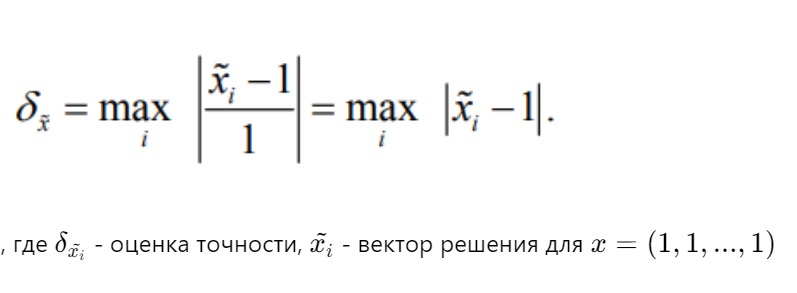
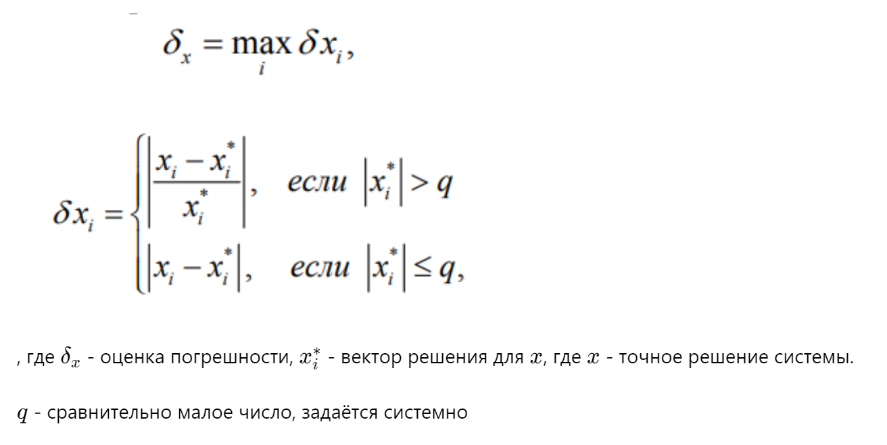
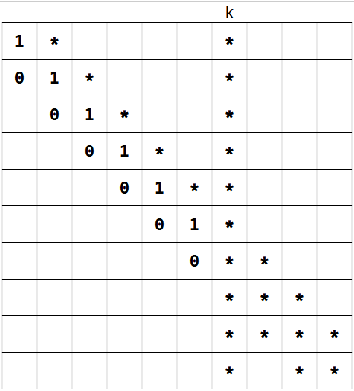
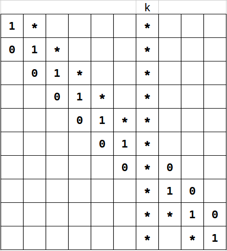
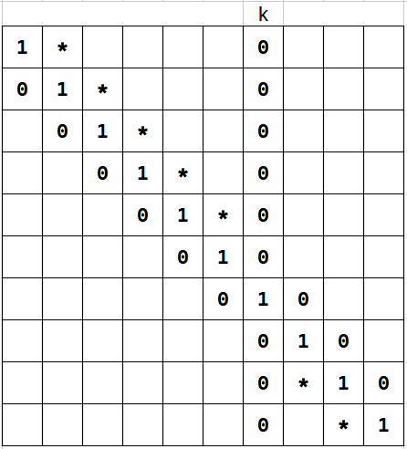
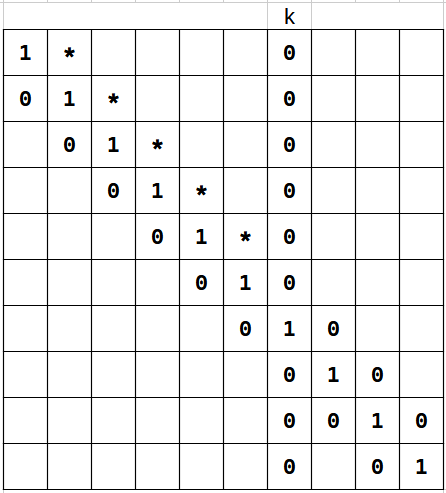
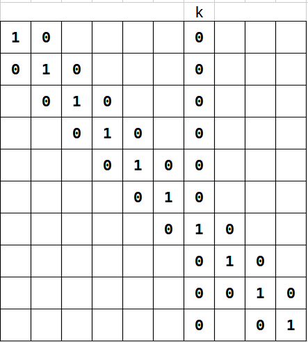

# Отчёт о выполнении индивидуального задания "Решение систем линейных уравнений с разреженными матрицами специального вида"

## Постановка задачи
Портреты матриц систем во всех вариантах задания различны и определяются номером варианта. 

Однако по структуре они похожи – имеют по три диагонали и «испорчены» либо двумя столбцами, либо двумя строками, либо одним столбцом и одной строкой.

Во всех вариантах исходные системы уравнений задаются шестью векторами: **a, b, c, f, p, q**. Векторы **a, b, c** содержат значения трех диагоналей
матрицы, **f** – вектор правой части системы, **p, q** – векторы для строк или
столбцов, которые «портят» матрицы системы. 

<div style="page-break-after: always;"></div>

## Теоретическая часть
Вариант \ 14

Система `(1)`

В данном варианте мы имеем диагональные векторы **a, b, c** и испорченный вектор **p** по индексу `0 < k < n - 1`



<!-- ```math
\begin{cases}
b_1*x_1 + c_1*x_2 + p_k*x_k &= f_1 & k > 2\\
b_1*x_1 + c_1*x_2 &= f_1 & k = 2\\

a_i*x_{i-1} + b_i*x_i + c_i*x_{i+1} + p_i*x_k &= f_i & i \notin (1, k-1, k, k+1, n-1)\\
a_i*x_{i-1} + b_i*x_i + p_i*x_{i+1} &= f_i & i = k-1, k \neq 2\\
a_i*x_{i-1} + p_i*x_i + c_i*x_{i+1} &= f_i & i = k\\
p_i*x_{i-1} + b_i*x_i + c_i*x_{i+1} &= f_i & i = k+1, k \neq n-1\\

b_{n}*x_n + a_{n-1}*x_{n-1} + p_{k}*x_{k} &= f_n & k < n-1\\
b_{n}*x_n + a_{n-1}*x_{n-1} &= f_n & k = n-1\\
\end{cases}
``` -->


<!-- , где $n$ - размерность системы, $k \in [1, n-1]$ -->

Оценки точности:



<!-- , где $\delta_{\tilde{x_i}}$ - оценка точности, $\tilde{x_i}$ - вектор решения для $x = (1, 1, ..., 1)$ -->

Оценки погрешностей:



<!-- , где $\delta_{x}$ - оценка погрешности, $x_i^*$ - вектор решения для $x$, где $x$ - точное решение системы. -->

<!-- $q$ - сравнительно малое число, задаётся системно  -->

<div style="page-break-after: always;"></div>

## Алгоритм
Для описания решения системы `(1)` воспользуемся символическим изображением алгоритма:

**Шаг первый**



<div style="page-break-after: always;"></div>

**Шаг второй**




<div style="page-break-after: always;"></div>

**Шаг третий**




<div style="page-break-after: always;"></div>

**Шаг четвертый, обратный ход**




<div style="page-break-after: always;"></div>

**Шаг пятый, обратный ход**




После проделанных шагов полученный вектор **f'** и будет решением системы `(1)`

<div style="page-break-after: always;"></div>

## Основные процедуры
`Деление строки на число:`
```python
    def div_line_by(self, line_idx, divisor):
        if divisor == 0:
            return None

        if line_idx > 0:
            self.a[line_idx - 1] /= divisor

        if line_idx < self.size - 1:
            self.c[line_idx] /= divisor

        self.b[line_idx] /= divisor
        self.p[line_idx] /= divisor
        self.f[line_idx] /= divisor
```
`Вычитание строк`
```python
    def subtract_from(self, from_idx, source_idx):
        if from_idx < source_idx:
            value = self.c[from_idx]

            if source_idx == self.k + 2:
                self.a[from_idx - 1] -= self.p[source_idx] * value

            self.c[from_idx] -= value
            self.b[from_idx] -= self.a[source_idx - 1] * value
            self.p[from_idx] -= self.p[source_idx] * value
            self.f[from_idx] -= self.f[source_idx] * value
        else:
            value = self.a[from_idx - 1]

            self.a[from_idx - 1] -= value

            if source_idx == self.k - 2:
                self.c[from_idx] -= self.p[source_idx] * value

            self.b[from_idx] -= self.c[source_idx] * value
            self.p[from_idx] -= self.p[source_idx] * value
            self.f[from_idx] -= self.f[source_idx] * value
```
`Процедура соответствующая первому проходу алгоритма`
```python
    def gauss_until_k(self):
        for i in range(self.k):
            self.div_line_by(i, self.b[i])
            self.subtract_from(i + 1, i)
```
`Процедура соответствующая второму проходу алгоритма`
```python
    def gauss_past_k(self):
        for i in range(self.size - 1, self.k, -1):
            self.div_line_by(i, self.b[i])
            self.subtract_from(i - 1, i)
```
`Процедура соответствующая третьему проходу алгоритма`
```python
    def gauss_line_k(self):
        self.div_line_by(self.k, self.b[self.k])
        f_k = self.f[self.k]

        self.a[self.k] = 0
        self.c[self.k - 1] = 0
        for i in range(self.k):
            value = self.p[i]
            self.p[i] -= value
            self.f[i] -= value * f_k

        for i in range(self.size - 1, self.k, -1):
            value = self.p[i]
            self.p[i] -= value
            self.f[i] -= value * f_k
```
`Процедура соответствующая четвертому проходу алгоритма`
```python
    def reverse_gauss_past_k(self):
        for i in range(self.k, self.size - 1):
            self.subtract_from(i + 1, i)
```
`Процедура соответствующая пятому проходу алгоритма`
```python
    def reverse_gauss_until_k(self):
        for i in range(self.k - 1, 0, -1):
            self.subtract_from(i - 1, i)
```
`Основные процедуры решения`
```python
    def input_matrix_vec(self, a, b, c, p, f, k):
        self.vec_form = True
        self.k = k
        self.size = b.shape[0]
        self.shape = (self.size, self.size)

        self.a = np.copy(a)
        self.b = np.copy(b)
        self.c = np.copy(c)
        self.p = np.copy(p)
        self.set_f(f)

    def solve(self):
        if not self.vec_form:
            self.build_vectors()

        self.gauss_until_k()

        self.gauss_past_k()

        self.gauss_line_k()

        self.reverse_gauss_until_k()

        self.reverse_gauss_past_k()
        return self.f
```

<div style="page-break-after: always;"></div>

## Результаты тестирования

Номер теста | Размерность системы | Диапазон значений | Средняя точность | Средняя погрешность
-- | -- | -- | -- | --
1 | 10 | (-10, 10) | `1.17E-13` | `5.69E-13`
2 | 10 | (-100, 100) | `4.20E-14` | `1.27E-12`
3 | 10 | (-1000, 1000) | `5.18E-11` | `4.11E-11`
4 | 100 | (-10, 10) | `4.02E-12` | `8.61E-12`
5 | 100 | (-100, 100) | `6.78E-12` | `8.95E-12`
6 | 100 | (-1000, 1000) | `1.36E-13` | `3,53E-12`
7 | 1000 | (-10, 10) | `3.61E-11` | `1.27E-10`
8 | 1000 | (-100, 100) | `1.17E-12` | `5.46E-11`
9 | 1000 | (-1000, 1000) | `3.83E-11` | `2.46E-10`