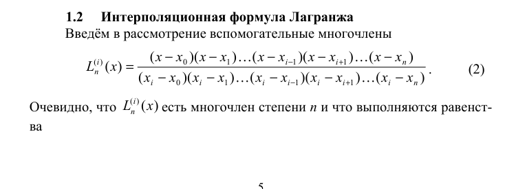
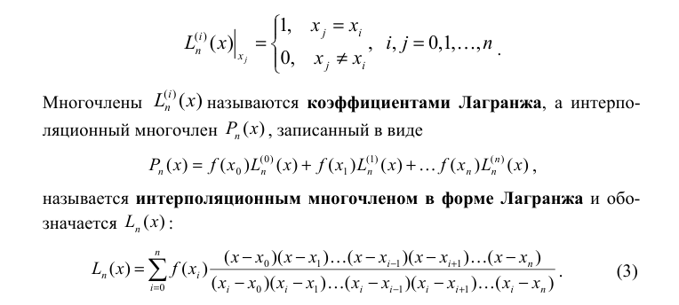
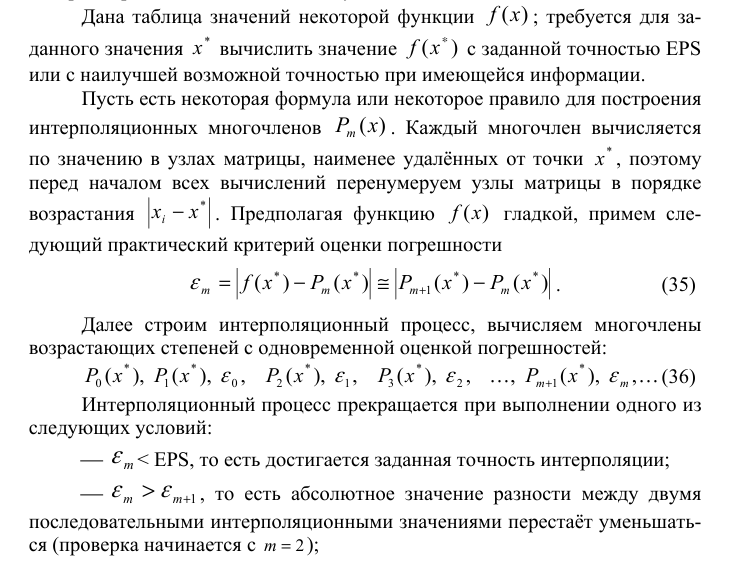

## 1. **Постановка задачи**
Интерполирование функции с помощью многочлена Лагранжа степени `m` на неравномерной сетке узлов.

Вычисляется значение интерполяционного многочлена Лагранжа в точке `XX` по значению функции в точках наименее удалённых от точки `XX`. 

## 2. **Теоретическая часть**
Данная задача предполагает использование алгоритма интерполирования в форме Лагранжа на неравномерной сетке узлов, где

форма Лагранжа описывается:

Неравномерная сетка представляет собой набор значений такой, что разность между его элементами не константна.

Также стоит учитывать погрешности:

## 3. **Алгоритм**
- Функция `lagrange_interpolation(X, Y, N, XX, m, eps)` выполняет интерполяцию Лагранжа для заданной функции на неравномерной сетке узлов. Она принимает следующие аргументы:
    - `X`: Массив координат узлов интерполяции.
    - `Y`: Массив значений функции в узлах интерполяции.
    - `N`: Количество узлов интерполяции.
    - `XX`: Точка, в которой вычисляется значение интерполяционного многочлена.
    - `m`: Максимальная cтепень интерполяционного многочлена Лагранжа.
    - `eps`:  Критерий остановки (точность).
- `func_a(x)`:  Функция, представляющая собой  y = (1/10)x^3 + x^2 + (1/2)x.
- `func_b(x)`:  Функция, представляющая собой  y = (1/2)x^4 + 2x^3 + (1/2)x^2 + (1/5)x.

## 4. **Тестирование**
| Тест | Тестовая точка | Актуальное значение | Приближенное значение   | Точность                | Степень многочлена |
| ---- | -------------- | ------------------- | ----------------------- | ----------------------- | ------------------ |
| 1    | -6.4           | 11.5456             | 11.545599999999999      | 1.7763568394002505e-15  | 5                  |
| 2    | 0              | 0                   | -3.0357660829594124e-18 | -3.0357660829594124e-18 | 5                  |
| 3    | 20             | 1210                | 1210.0000000000018      | 1.8189894035458565e-12  | 5                  |
