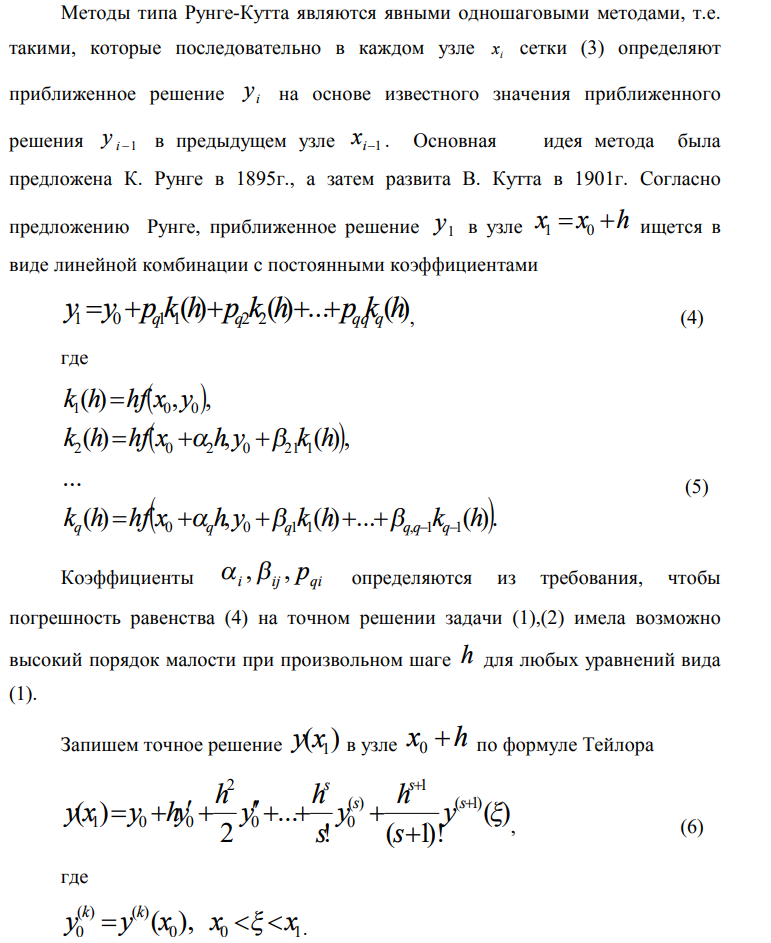
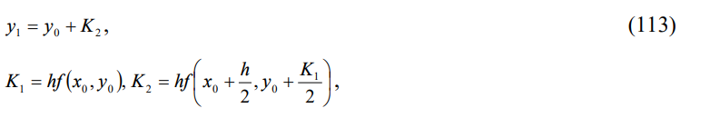
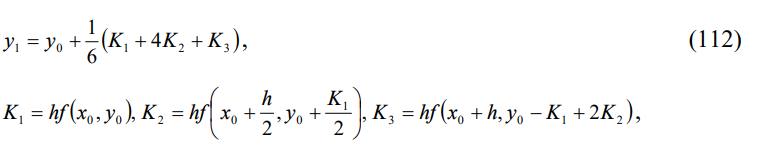

## Отчёт о программе решения задачи Коши адаптивным методом Рунге-Кутты

### 1. Постановка задачи

Программа предназначена для численного решения задачи Коши для обыкновенных дифференциальных уравнений (ОДУ) первого порядка вида `dy/dx = f(x, y), y(x0) = y0` на заданном интервале `[start, end]` с использованием адаптивного метода Рунге-Кутты. Адаптивность заключается в автоматическом выборе шага интегрирования `h` в зависимости от требуемой точности.

### 2. Теоретическая часть

В программе реализован метод Рунге-Кутты 2-го и 3-го порядков. Оценка погрешности производится на каждом шаге путем сравнения результатов, полученных этими двумя методами. Если оценка погрешности превышает заданную точность, шаг интегрирования уменьшается. В противном случае шаг может быть увеличен для повышения эффективности вычислений.

Метод Рунге-Кутты 2-го порядка (RK2):

Метод Рунге-Кутты 3-го порядка (RK3):

Оценка погрешности: `error_estimation = abs(rk2 - rk3)`

Адаптивный выбор шага:
- Если `error_estimation > tolerance`, то `h = h / 2`
- Если `error_estimation <= tolerance`, то `h = h * 2` (если это возможно)

### 3. Алгоритм

1.  **`runge_kutta(f, x_current, y_current, h, direction=1)`**:
    *   Вычисляет приближения RK2 и RK3 для одного шага.
    *   Возвращает кортеж `(rk2, rk3)`.
    *   Учитывает направление интегрирования `direction` (1 для прямого, -1 для обратного).

2.  **`solve_cauchy_adaptive_step(f, y0, C, x_start, x_end, h_initial, h_min, tolerance)`**:
    *   Решает задачу Коши на интервале `[x_start, x_end]` с начальным условием `y(C) = y0`.
    *   Использует адаптивный выбор шага `h` с начальным значением `h_initial` и минимальным значением `h_min`.
    *   Оценивает погрешность на каждом шаге и корректирует шаг `h` в соответствии с заданной точностью `tolerance`.
    *   Записывает результаты (x, y, h, error_estimation) в файл "output.txt".
    *   Обрабатывает случай, когда шаг становится меньше `h_min`.

3.  **`visualize_results()`**:
    *   Использует `matplotlib` для построения графика численного решения `y(x)` и графика зависимости шага интегрирования `h(x)`.

### 4. Тестирование