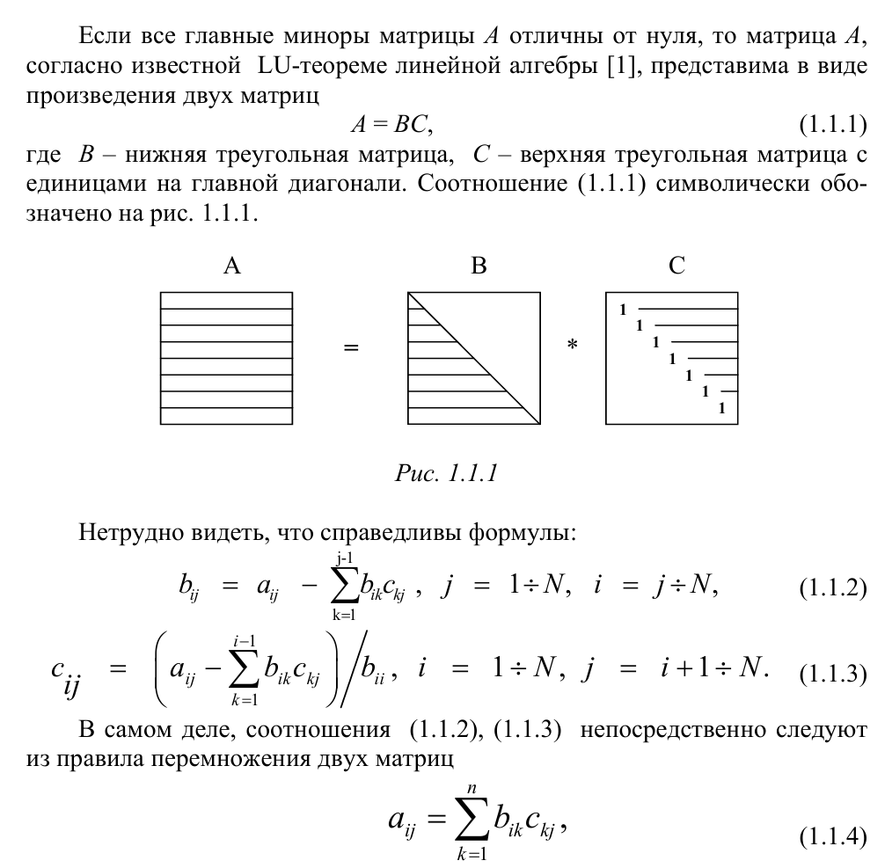
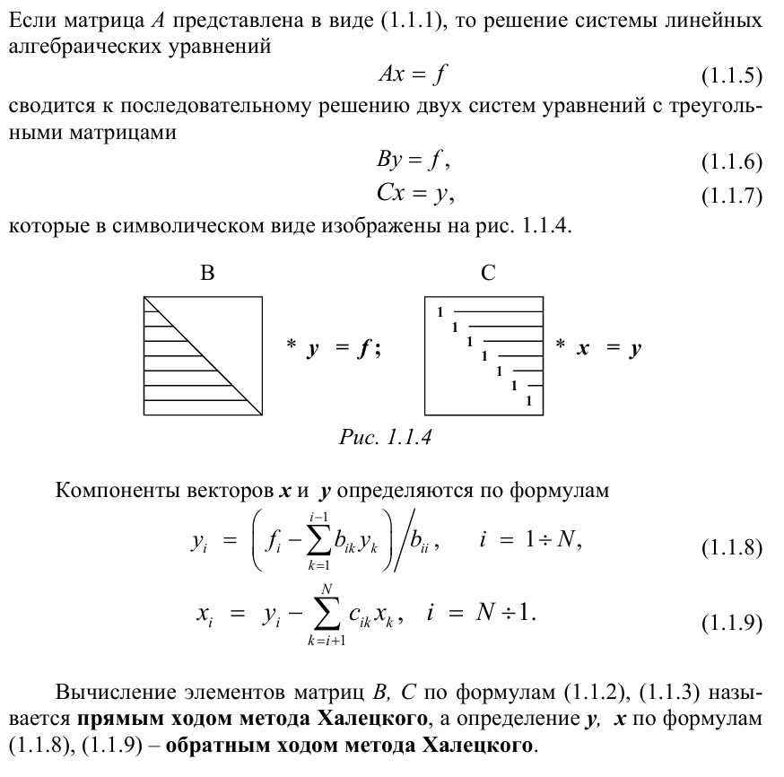
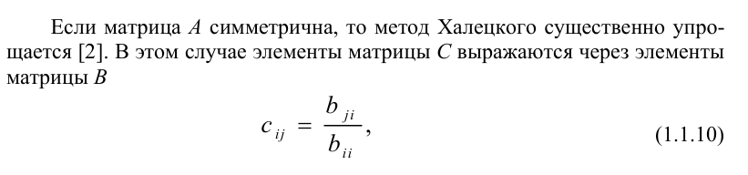
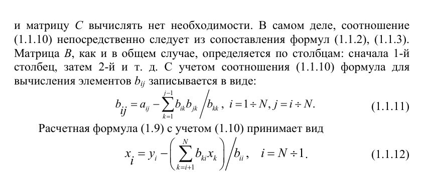
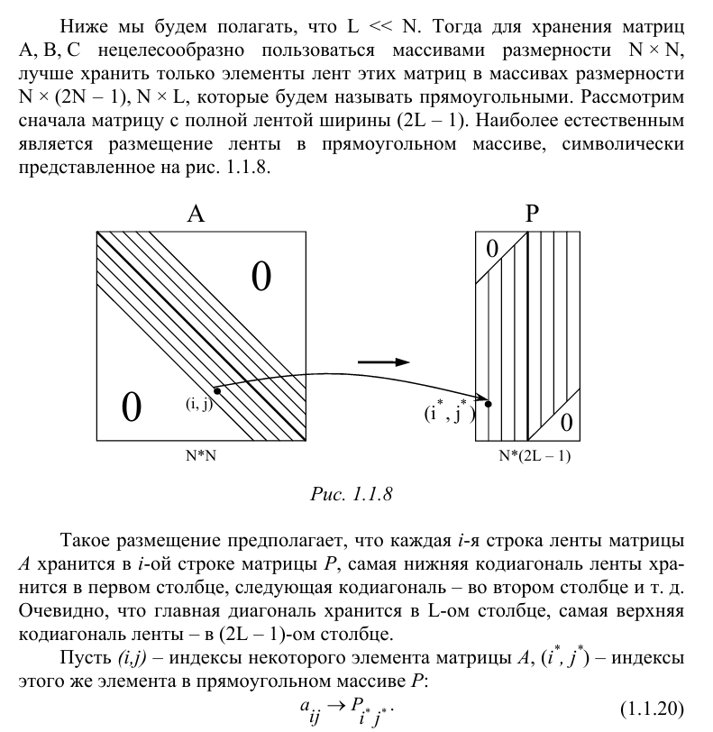
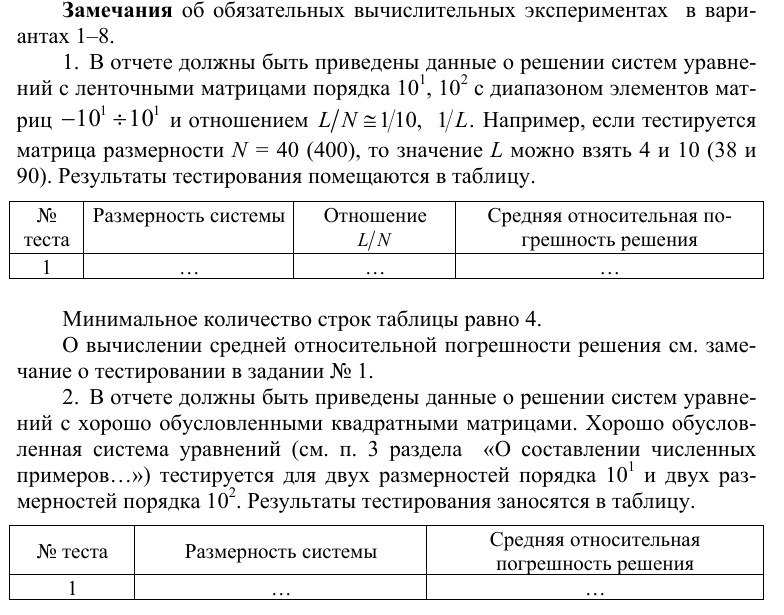
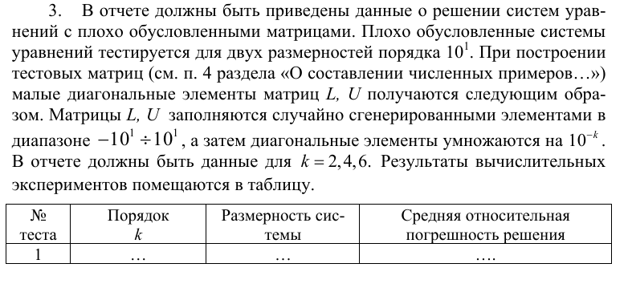

## 1. **Постановка задачи**

Необходимо реализовать **метод Халецкого** для решения СЛАУ с симметричными ленточными матрицами.

При численной реализации недопустимо использование матриц размерности (N, N).

## 2. **Теоретическая часть**

Данная задача преполагает использование алгоритма Холецкого, который основывается на теореме:

После явного разложения матрицы две состовляющие B и C можно приступить к непосредственному решению системы:

Условие симметричности позволяет нам упростить вычисления:

Также хранение матриц осуществляется с помощью ленточного представления:

Тестирование:

## 3. **Алгоритм**

- Функция `GenerateMatrix()` генерирует ленточную матрицу по заданным параметрам.
- Функция `Halecki()` является основой функцией программы, она осуществляет прямой и обратный проходы алгоритма, возвращая найденный вектор решения.
- Функция `GetPricision()` вычисляет отностительную погрешность решения.
- Функции `GetMatrixB`, `GetVectorY`, `GetVectorX` являются вспомогательными, они раскладывают матрицу по теореме, затем ищут вектор решения икс.

## 4. **Тестирование**

#### Данные о решении систем уравнений с ленточными матрицами:
| Номер теста | Размерность | L/N  | Погрешность |
| ----------- | ----------- | ---- | ----------- |
| 1           | 20          | 0.1  | 5.35 e-15   |
| 2           | 40          | 0.25 | 1.96 e-13   |
| 3           | 200         | 0.1  | 9.6  e-12   |
| 4           | 400         | 0.25 | 1.59 e-10   |

#### Данные о решении систем уравнений с хорошо обусловленными ленточными матрицами:
| Номер теста | Размерность | Погрешность |
| ----------- | ----------- | ----------- |
| 1           | 34          | 8.74 e-16   |
| 2           | 56          | 6.89 e-16   |
| 3           | 374         | 3.14 e-15   |
| 4           | 634         | 4.01 e-15   |

#### Данные о решении систем уравнений с плохо обусловленными ленточными матрицами:
| Номер теста | Размерность | Порядок k | Погрешность |
| ----------- | ----------- | --------- | ----------- |
| 1           | 20          | 2         | 7.63 e-12   |
| 2           | 60          | 2         | 3.91 e-11   |
| 3           | 20          | 4         | 2.36 e-08   |
| 4           | 60          | 4         | 1.03 e-05   |
| 5           | 20          | 6         | 0.0011      |
| 6           | 60          | 6         | 0.0014      |