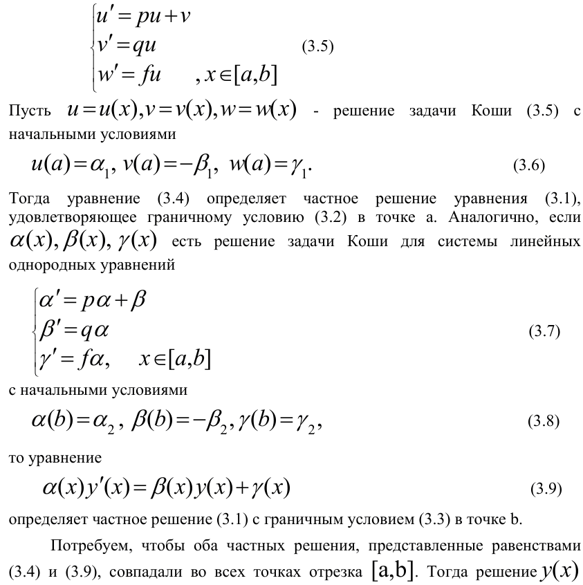

## Отчёт о программе решения краевой задачи методом универсальной прогонки

### 1. Постановка задачи

Программа предназначена для численного решения краевой задачи для обыкновенного дифференциального уравнения (ОДУ) второго порядка вида:

`y'' + p(x)y' + q(x)y = f(x)`

с граничными условиями:

`alpha1 * y(a) + beta1 * y'(a) = gamma1`  
`alpha2 * y(b) + beta2 * y'(b) = gamma2`

на заданном интервале `[a, b]` с использованием метода универсальной прогонки

### 2. Теоретическая часть

Метод универсальной прогонки сводит решение краевой задачи к решению двух задач Коши с последующим решением системы линейных алгебраических уравнений.

**Решение задач Коши:**  
    *   Выбираются два линейно независимых начальных условия для решения однородного уравнения. В данном случае, это достигается заданием `alpha1, beta1, gamma1` и `alpha2, beta2, gamma2`.  
    *   Решаются две задачи Коши с выбранными начальными условиями. В коде используются функции `runge_kutta_2` и `runge_kutta_2_reversed` для численного решения методом Рунге-Кутты 2-го порядка.  Важно отметить, что `runge_kutta_2_reversed` решает задачу Коши в обратном направлении.  
    *   В результате получаются два решения, `u(x)` и `alpha(x)`, `v(x)` и `beta(x)`, `w(x)` и `gamma(x)`, каждое из которых удовлетворяет дифференциальному уравнению, но не обязательно граничным условиям.

### 3. Алгоритм

2.  **`runge_kutta_2`**:
    *   Решает задачу Коши методом Рунге-Кутты 2-го порядка в прямом направлении.  `f_list` содержит функции, определяющие компоненты системы дифференциальных уравнений первого порядка, к которой сведено исходное уравнение второго порядка. `grid` задает сетку, на которой ищется решение.

3.  **`runge_kutta_2_reversed`**:
    *   Решает задачу Коши методом Рунге-Кутты 2-го порядка в обратном направлении.

4.  **`solve_linear_algebraic_system`**:
    *   Решает систему линейных алгебраических уравнений для определения коэффициентов 'y', ' y' '.

5.  **Основной блок `if __name__ == "__main__":`**:
    *   Считывает входные данные.
    *   Определяет функции `p(x)`, `q(x)`, `f(x)`, которые задают дифференциальное уравнение.
    *   Формирует `f_list_1` и `f_list_2` для решения задач Коши в прямом и обратном направлениях, соответственно.
    *   Решает задачи Коши.
    *   Решает систему линейных уравнений для каждого узла сетки.
    *   Строит график решения.

### 4. Тестирование

(Здесь должны быть примеры входных файлов и ожидаемые результаты)
