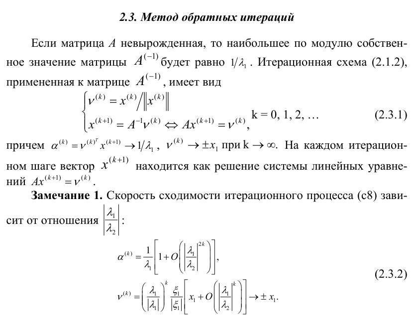
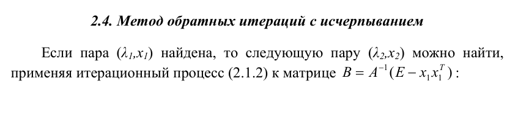
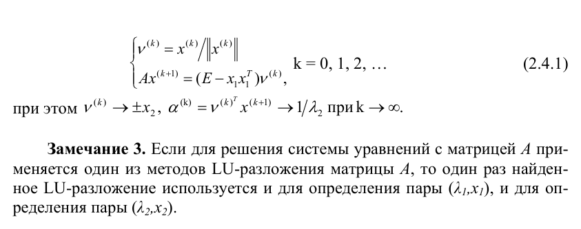
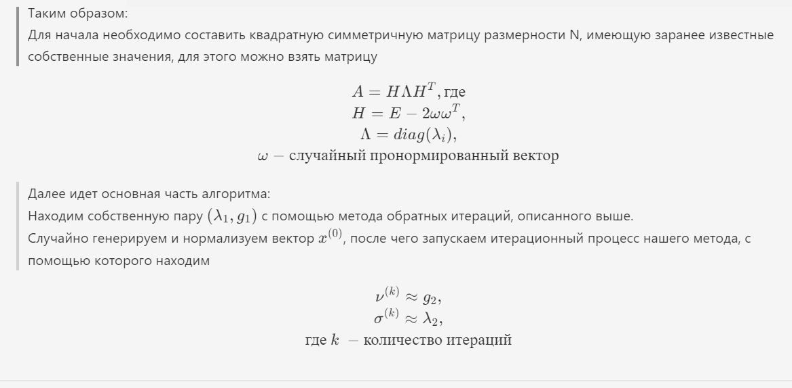

## 1. **Постановка задачи**

Необходимо реализовать метод обратных итераций с исчерпыванием определения пары со вторым минимальным по модулю собственным значением симметричной матрицы простой структуры

Для решения линейной системы уравнений использовать метод Халецкого

## 2. **Теоретическая часть**

Данная задача преполагает использование алгоритма обратных итераций с исчерпыванием, то есть нахождение второго минимального по модулю собственного значения. Этот алгоритм использует знание, которое нужно получить с помощью обычного метода обратных итераций

Описание и формулы данных алгоритмов:

<!-- Таким образом:  
Для начала необходимо составить квадратную симметричную матрицу размерности N, имеющую заранее известные собственные значения, для этого можно взять матрицу
$$
A = H \Lambda H^T, где \\
H = E - 2 \omega \omega^T, \\
\Lambda = diag(\lambda_i), \\
\omega - случайный \: пронормированный \: вектор
$$

Далее идет основная часть алгоритма:  
Находим собственную пару $(\lambda_1, g_1)$ с помощью метода обратных итераций, описанного выше. \
Случайно генерируем и нормализуем вектор $x^{(0)}$, после чего запускаем итерационный процесс нашего метода, с помощью которого находим
$$
\nu^{(k)} \approx g_2, \\
\sigma^{(k)} \approx \lambda_2, \\
где \: k \: -  количество \: итераций
$$ -->

## 3. **Алгоритм**
- Функция `TEST_generate_householder_mat()` генерирует вышеупомянутую матрицу A
- Функция `inverse_iteration()` - это реализация алгоритма обратных итераций, для нахождения первой минимальной собственной пары
- Функция `inverse_iteration_with_shift_one()` - это реализация алгоритма обратных итераций с исчерпыванием, для нахождения второй минимальной собственной пары
- Функция `TEST()` нужна для тестирования случайно сгенерированных матриц и оценки погрешностей вычислений

## 4. **Тестирование**
| № теста | Размерность системы N | Диапазон значений λ | ε Точность | Ср. оценка точности собств. значений | Ср. оценка точности собств. векторов | Средняя мера точности r | Среднее число итераций |
| ------- | --------------------- | ------------------- | ---------- | ------------------------------------ | ------------------------------------ | ----------------------- | ---------------------- |
| 1       | 10                    | 2                   | 1e-13      | 1.332e-13                            | 1.120e-06                            | 3.114e-07               | 77.5                   |
| 2       | 10                    | 2                   | 1e-13      | 2.132e-13                            | 1.340e-06                            | 7.556e-09               | 42.5                   |
| 3       | 10                    | 50                  | 1e-13      | 1.547e-11                            | 2.281e-06                            | 1.230e-05               | 37.8                   |
| 4       | 10                    | 50                  | 1e-13      | 1.024e-11                            | 3.130e-06                            | 3.284e-06               | 35.4                   |
| 5       | 30                    | 2                   | 1e-13      | 1.012e-14                            | 2.779e-07                            | 4.057e-10               | 30.6                   |
| 6       | 30                    | 2                   | 1e-13      | 9.349e-07                            | 1.309e-02                            | 3.302e-09               | 75.7                   |
| 7       | 30                    | 50                  | 1e-13      | 4.109e-11                            | 3.002e-06                            | 4.603e-07               | 52.5                   |
| 8       | 30                    | 50                  | 1e-13      | 3.076e-11                            | 3.919e-06                            | 2.734e-06               | 89.0                   |
| 9       | 50                    | 2                   | 1e-13      | 8.733e-06                            | 3.767e-02                            | 2.021e-08               | 127.2                  |
| 10      | 50                    | 2                   | 1e-13      | 1.608e-06                            | 1.418e-02                            | 2.637e-10               | 141.0                  |
| 11      | 50                    | 50                  | 1e-13      | 4.060e-12                            | 2.419e-06                            | 1.812e-06               | 59.1                   |
| 12      | 50                    | 50                  | 1e-13      | 5.678e-11                            | 4.289e-06                            | 2.767e-06               | 59.7                   |

